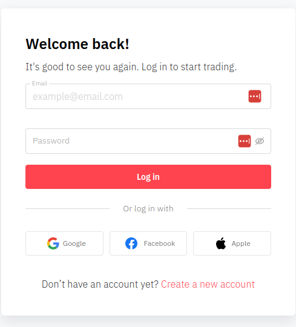

# Authenticate and authorise the API
Without authorisation and authentication you'll only get access to roughly half of our API calls and features. For example, in order to buy contracts or utilise the `Copy Trading` features, your users must be authenticated and authorised by our **OAuth provider** and **WebSocket Server**.


## Before you start
Make sure you have a:

* Deriv Client account.
* Deriv API token with the appropriate access level. For detailed instructions on how to create a deriv API token and application, see [Create a Deriv application](./createderivapp.md)
* Deriv app ID.


## Instructions

### Step 1. Authenticate the API
1. To authenticate your user, specify the URL that will be used as the OAuth Redirect URL on the [Dashboard](https://api.deriv.com/dashboard) page, **Register application** tab in the **OAuth details** fields.

    1. Specify the URL that will be used as the **OAuth Redirect URL** on the app registration page in the **Website URL** field.
    2. Add a login button on your website or app and direct users to `https://oauth.deriv.com/oauth2/authorize?app_id=your_app_id` where your_app_id is the ID of your app.
    3. Once a user signs up, they will be redirected to the URL that you entered as the **Redirect URL**. This URL will have arguments added to it with the user's session tokens, and will look similar to: `https://[YOUR_WEBSITE_URL]/redirect/?acct1=cr799393& token1=a1-f7pnteezo4jzhpxclctizt27hyeot&cur1=usd& acct2=vrtc1859315& token2=a1clwe3vfuuus5kraceykdsoqm4snfq& cur2=usd&state=`
    4. In the parameters of the URL, you will see all the accounts and the session token for each account. Pass these tokens to the Authorize API call in order to perform actions on behalf of the account.

2. Then, add a login button on your website or app and direct users to `https://oauth.deriv.com/oauth2/authorize?app_id=your_app_id` where your_app_id is the ID of your app.



Once a user signs up/logs in, they will be redirected to the URL that you entered as the Redirect URL. This URL will have arguments added to it with the user's session tokens, and will look similar to this:

`https://[YOUR_WEBSITE_URL]/redirect/?acct1=cr799393& token1=a1-f7pnteezo4jzhpxclctizt27hyeot&cur1=usd& acct2=vrtc1859315& token2=a1clwe3vfuuus5kraceykdsoqm4snfq& cur2=usd`

### Step 2. Authorise the API

The query parameters in the redirect URL are the user's accounts and their related session tokens. You can map the query parameters to an array using the following approach:

```
const user_accounts = [
  {
    account: 'cr799393',
    token: 'a1-f7pnteezo4jzhpxclctizt27hyeot',
    currency: 'usd',
  },
  {
    account: 'vrtc1859315',
    token: 'a1clwe3vfuuus5kraceykdsoqm4snfq',
    currency: 'usd',
  },
];
```

To authorise the user based on the user's selected account, call the authorize API call with the user's selected account session token:

```
{
  "authorize": "a1-f7pnteezo4jzhpxclctizt27hyeot"
}
```
The response for the authorize call would be an object as below:

```
{
    "account_list": [
      {
        "account_type": "trading",
        "created_at": 1647509550,
        "currency": "USD",
        "is_disabled": 0,
        "is_virtual": 0,
        "landing_company_name": "svg",
        "loginid": "CR799393",
        "trading": {}
      },
      {
        "account_type": "trading",
        "created_at": 1664132232,
        "currency": "ETH",
        "is_disabled": 0,
        "is_virtual": 0,
        "landing_company_name": "svg",
        "loginid": "VRTC1859315",
        "trading": {}
      },
    ],
    "balance": 0,
    "country": "id",
    "currency": "USD",
    "email": "user_mail@email_provider.com",
    "fullname": " John Doe",
    "is_virtual": 0,
    "landing_company_fullname": "Deriv (SVG) LLC",
    "landing_company_name": "svg",
    "local_currencies": {
      "IDR": {
        "fractional_digits": 2
      }
    },
    "loginid": "CR799393",
    "preferred_language": "EN",
    "scopes": [
      "read",
      "trade",
      "trading_information",
      "payments",
      "admin"
    ],
    "trading": {},
    "upgradeable_landing_companies": [
      "svg"
    ],
    "user_id": 12345678
  }
  ```
The user is now authorised, and you can use Deriv API calls on behalf of the account.
